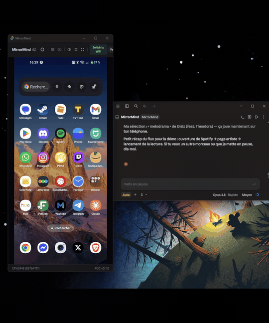

# MirrorMind

Stream your Android phone screen to your desktop and let Claude Code see and control it.


[](https://github.com/AlexherDev69/MirrorMind/releases/latest)

**[⬇ Download the latest installer](https://github.com/AlexherDev69/MirrorMind/releases/latest)** — Windows MSI / NSIS. Requires `adb` on PATH and Node.js (for the MCP feature).

## What is MirrorMind?

MirrorMind is a lightweight Windows desktop app that does two things:

1. **Phone Streaming** — Plug your Android phone via USB, and its screen appears instantly on your desktop. Touch, scroll, type, and control your phone from your computer.

2. **MCP Server** — Claude Code can see your phone screen and interact with it through 18 MCP tools. Take screenshots, tap buttons, type text, navigate apps, run macros — all from your AI assistant.

## Demo

<p align="center">
  
</p>

```
You:  "Open Letterboxd and find the movie Inception"

Claude: runs phone_batch → launches app → taps Search → types "Inception" → taps result
        → sends you a screenshot of the Inception page
        Done in ~6 seconds, single MCP call.
```

## Features

### Phone Streaming
- Auto-detect phone on USB plug (zero config after first setup)
- Real-time screen mirroring via scrcpy protocol
- Hardware-accelerated H.264 decoding (WebCodecs API)
- Touch, swipe, scroll, and keyboard input forwarding
- Mini-player mode (always-on-top, draggable)
- Fullscreen mode (F11)
- Screenshot & screen recording
- Logcat viewer with level filtering
- Auto-reconnect on cable unplug/replug

### MCP Tools (MirrorMind)
| Tool | Description |
|------|-------------|
| `phone_screenshot` | Capture the phone screen (compressed JPEG) |
| `phone_screenshot_grid` | Screenshot with numbered grid overlay for precise tapping |
| `phone_tap` | Tap at coordinates (percentage-based) |
| `phone_swipe` | Swipe gesture |
| `phone_type_text` | Type text on the phone |
| `phone_press_key` | Press hardware keys (back, home, enter, etc.) |
| `phone_batch` | Execute multiple actions in one call (17 action types) |
| `phone_run_app` | Launch an app by package name |
| `phone_deep_link` | Open deep links (supports 30+ app shorthands) |
| `phone_get_ui_tree` | Get the accessibility tree (text, bounds, IDs) |
| `phone_find_text` | OCR — find text on screen with coordinates |
| `phone_wait_for_text` | Wait until specific text appears |
| `phone_wait_for_change` | Wait until the screen changes |
| `phone_get_current_activity` | Get the current foreground app/activity |
| `phone_get_info` | Get device info (model, battery, screen size, etc.) |
| `phone_list_devices` | List connected ADB devices |
| `phone_list_macros` | List saved macros |
| `phone_replay_macro` | Replay a saved macro |

### Batch Actions
`phone_batch` supports 17 action types in a single call:
`tap`, `swipe`, `type`, `key`, `wait`, `screenshot`, `back`, `home`, `ui_tree`, `run_app`, `deep_link`, `tap_by_text`, `tap_by_id`, `tap_by_desc`, `wait_screen_change`, `wait_for_text`, `assert_text`

### Action Recorder
Record your interactions (taps, swipes, text input) and save them as macros. Export as JSON or as MCP `phone_batch` format for Claude to replay.

## Architecture

```
Android Phone (USB)
    -> adb (port forwarding)
    -> scrcpy-server.jar (H.264 encoding on phone)
    -> TCP localhost:27183
    -> Rust backend (Tauri, reads H.264 packets)
    -> Frontend (WebCodecs VideoDecoder -> Canvas)

Claude Code (CLI)
    -> stdio JSON-RPC -> MCP Server (Node.js)
    -> HTTP localhost:17395 (Bearer token auth)
    -> Tauri internal API (Axum)
    -> Rust backend -> adb -> Phone
```

## Tech Stack

| Component | Technology |
|-----------|-----------|
| Desktop app | Tauri 2.x (Rust + WebView2) |
| Frontend | React 19 + TypeScript 5.8 + Vite 7 |
| Styling | Tailwind CSS 4 |
| State | Zustand 5 |
| Video | scrcpy protocol + WebCodecs API |
| MCP server | Node.js + @modelcontextprotocol/sdk |
| OCR | Tesseract.js v5 |
| Validation | Zod |
| Monorepo | pnpm workspaces |

## Prerequisites

- **Windows 10/11**
- **Node.js** >= 20
- **pnpm** >= 9
- **Rust** >= 1.77.2
- **ADB** on PATH
- Android phone + USB cable

### Step-by-step prerequisites installation

<details>
<summary><b>1. Node.js</b></summary>

Download and install Node.js **v20+** from [nodejs.org](https://nodejs.org/).

Pick the LTS version. The installer adds Node to your PATH automatically.

Verify:
```bash
node --version   # should print v20.x.x or higher
```
</details>

<details>
<summary><b>2. pnpm</b></summary>

Once Node.js is installed:
```bash
npm install -g pnpm
```

Verify:
```bash
pnpm --version   # should print 9.x.x or higher
```
</details>

<details>
<summary><b>3. Rust</b></summary>

Rust is needed to compile the Tauri backend.

1. Download and run [rustup-init.exe](https://rustup.rs/)
2. Follow the on-screen instructions (default options are fine)
3. **Restart your terminal** after installation

Verify:
```bash
rustc --version    # should print 1.77.x or higher
cargo --version
```

> **Note**: On Windows, Rust also requires the [Visual Studio C++ Build Tools](https://visualstudio.microsoft.com/visual-cpp-build-tools/). The rustup installer will prompt you to install them if missing. Select "Desktop development with C++" workload.
</details>

<details>
<summary><b>4. ADB (Android Debug Bridge)</b></summary>

ADB is the bridge between your computer and Android phone.

1. Download [Android SDK Platform Tools](https://developer.android.com/tools/releases/platform-tools) for Windows
2. Extract the ZIP somewhere permanent (e.g. `C:\platform-tools`)
3. **Add to PATH**:
   - Open Windows Settings → search "Environment Variables"
   - Edit the `Path` variable under "User variables"
   - Add the folder path (e.g. `C:\platform-tools`)
   - Click OK and **restart your terminal**

Verify:
```bash
adb version   # should print "Android Debug Bridge version 1.0.x"
```
</details>

<details>
<summary><b>5. Enable USB Debugging on your phone</b></summary>

This is required for your computer to communicate with your phone.

1. Go to **Settings → About phone**
2. Tap **Build number** 7 times (this enables Developer Options)
3. Go back to **Settings → Developer Options**
4. Enable **USB Debugging**

> The exact path varies by phone brand. The app will show you brand-specific instructions when you first connect.
</details>

## Installation

```bash
# Clone the repo
git clone https://github.com/AlexherDev69/MirrorMind.git
cd MirrorMind

# Install dependencies
pnpm install

# Launch in dev mode (builds everything + starts Tauri app)
pnpm dev
```

That's it. No `.env` file, no manual config, no tokens to copy.

> **First build** takes a few minutes (Rust compilation). Subsequent launches are fast thanks to caching.

## First-time Phone Setup

When you launch the app for the first time with a phone plugged in:

1. The app **auto-detects your phone brand** (Samsung, Xiaomi, Pixel, OnePlus, etc.)
2. Shows you **step-by-step instructions** specific to your phone to enable USB debugging
3. When you authorize the computer on your phone, the **stream starts automatically**
4. From now on, just plug your phone and it works instantly (no setup needed again)

## MCP Setup (for Claude Code)

MirrorMind lets Claude Code see and control your phone. Setup is automatic:

1. Open MirrorMind settings (gear icon in the header)
2. Click **"Install MCP"**
3. Select your project folder
4. Restart Claude Code

That's it. The app:
- Generates an auth token automatically
- Creates the `.mcp.json` config in your project
- Claude Code picks it up on restart

> You can install MCP on multiple projects. Each gets the same token pointing to the running app.

## Usage

### From the app
- **Stream**: plug phone, it streams automatically
- **Touch**: click on the stream to tap, scroll to scroll, type to type
- **Mini-player**: `Ctrl+Shift+M` — floating always-on-top window
- **Fullscreen**: `F11`
- **Logcat**: `Ctrl+L` — view Android logs in real-time
- **Record**: record interactions as replayable macros

### From Claude Code
```
> Take a screenshot of my phone
> Open Instagram and go to my DMs
> Find the "Login" button on screen and tap it
> Type "hello world" and press Enter
> Run the "login-flow" macro
```

## Project Structure

```
MirrorMind/
├── packages/
│   ├── app/                  # Tauri desktop application
│   │   ├── src/              # React frontend (features/, core/)
│   │   └── src-tauri/        # Rust backend (commands, internal API)
│   ├── mcp-server/           # MirrorMind MCP server
│   │   └── src/features/     # 18 MCP tools
│   └── shared/               # Shared TypeScript types & constants
├── .github/workflows/        # CI (lint, test, cargo check)
└── package.json              # Workspace scripts
```

## Scripts

```bash
pnpm dev              # Build MCP + launch Tauri dev
pnpm build            # Build MCP + Tauri production build
pnpm build:mcp        # Build MCP server only
pnpm build:shared     # Build shared types
pnpm typecheck        # TypeScript check all packages
pnpm lint             # Lint all packages
pnpm test             # Run all tests
```

## Security

- Internal API binds to `127.0.0.1` only (never exposed to network)
- Auth via persisted crypto-random token
- Host header validation (DNS rebinding protection)
- Constant-time token comparison (timing attack protection)
- ADB serial validation (injection protection)
- Deep link URI scheme whitelist
- Rate limiting at 100 req/s
- No telemetry, no frame caching on disk

## Roadmap

- [x] USB auto-detection + scrcpy streaming
- [x] Touch, keyboard, scroll control
- [x] MCP server with 18 tools
- [x] Onboarding wizard (per-brand instructions)
- [x] Batch actions for speed
- [x] UI accessibility tree parsing
- [x] OCR text detection
- [x] Action recorder + macros
- [x] Logcat viewer
- [x] Mini-player + fullscreen
- [ ] Audio forwarding
- [ ] WiFi mode (wireless ADB)
- [ ] Clipboard sharing
- [ ] Video recording (MP4 export)
- [ ] Multi-device support
- [ ] iOS support

## License

MIT
